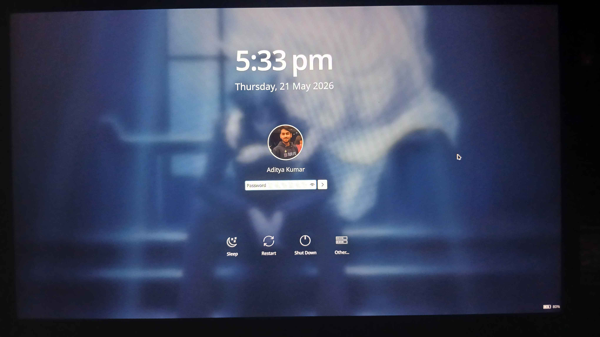
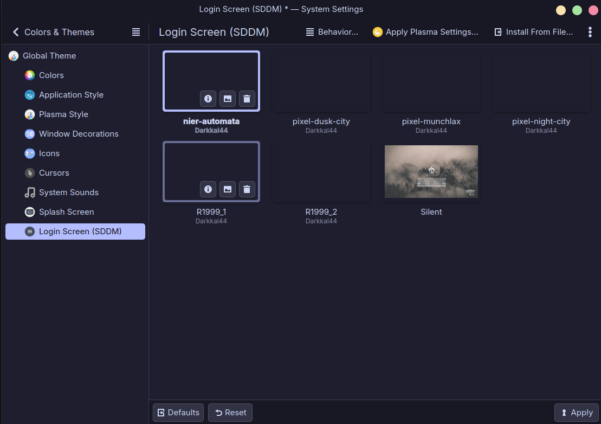

# Fedora KDE Plasma Dotfiles

> My personal KDE Plasma rice on Fedora:- Configs, themes, and setup guide for public.


---

## Preview

<table border="0">
  <tr>
    <td align="center">
      
      <br>
      <sub>Desktop Preview</sub>
    </td>
    <td align="center">
      
      <br>
      <sub>KDE Control Station</sub>
    </td>
  </tr>

  <tr>
    <td align="center">
      
      <br>
      <sub>PlasMusic Toolbar Widget</sub>
    </td>
    <td align="center">
        
        <br>
        <sub>fastfetch</sub>
    </td>
  </tr>
</table>

---

## System Info

| Component | Details |
|-----------|---------|
| **OS** | Fedora 44 |
| **DE** | KDE Plasma 6.6.5 |
| **Theme** | Catppuccin Mocha Lavender Classic |
| **Icons** | Tela Circle |
| **Terminal** | Konsole |
| **Font** | Inter 8pt |
| **Wallpaper** | Slideshow (custom collection) |

---

## What's in This Repo

```
kde/
├── .config/
│   ├── kdeglobals                               # Colors, fonts
│   ├── kwinrc                                   # Blur, transparency, window effects
│   ├── plasmarc                                 # Plasma settings
│   ├── plasmashellrc                            # Panel layout
│   ├── plasma-org.kde.plasma.desktop-appletsrc  # Widgets + panel config
│   ├── kcminputrc                               # Mouse/input settings
│   ├── kscreenlockerrc                          # Lock screen settings
│   ├── kglobalshortcutsrc                       # Keyboard shortcuts
│   ├── kcmfonts                                 # Font settings
│   ├── krunnerrc                                # KRunner settings
│   └── konsolerc                                # Konsole window settings
└── .local/share/konsole/
    ├── aditya.profile                           # Konsole profile
    └── WhiteOnBlack.colorscheme                 # Konsole color scheme
```

---

## Installation

### 1. Clone This Repo

```bash
git clone https://github.com/AdityaKr015/Fedora-KDE-Plasma-dotfiles.git
cd Fedora-KDE-Plasma-dotfiles
```

### 2. Copy Config Files

```bash
cp -r kde/.config/* ~/.config/
cp -r kde/.local/share/konsole/* ~/.local/share/konsole/
```

> ⚠️ This will overwrite your existing KDE configs. Back up your current configs first if needed.

---

## Theme Setup

### Catppuccin KDE

Check the [Catppuccin KDE repo](https://github.com/catppuccin/kde) for previews of all flavours and colour schemes before installing.

```bash
git clone --depth=1 https://github.com/catppuccin/kde catppuccin-kde
cd catppuccin-kde
./install.sh
```

Follow the prompts:-

Choose your flavour and accent colour. I use **Mocha + Lavender + Classic**.

After installing:-
- Go to **System Settings -> Global Theme** and select Catppuccin
- Go to **Colors & Themes -> Window Decorations** to customise further

---

### Tela Circle Icons

Check the [Tela Circle repo](https://github.com/vinceliuice/Tela-circle-icon-theme) for previews.

```bash
git clone https://github.com/vinceliuice/Tela-circle-icon-theme.git
cd Tela-circle-icon-theme
./install.sh --help   # See available variants
./install.sh -a -c    # Install all variants + circular style (what I use)
```

After installing:
- Go to **System Settings -> Global Theme -> Icons** and select your preferred Tela variant

---

## Widgets

| Widget | Purpose |
|--------|---------|
| **KDE Control Station** | System tray popup (pre-installed, just add from widget menu) |
| **Thermal Monitor** | CPU temperature on desktop |
| **Clear Clock** | Clean clock widget on desktop |
| **PlasMusic Toolbar** | Music player controls in taskbar (album art, seek bar, prev/next/pause) |

To add widgets: **Right click on desktop -> Add or Manage Widgets**

> I am just showing clock setting, for other widgets customize as per your preference.

> For system tray: right click taskbar -> Configure, move items to popup as preferred.

---

### Clock Settings

Using the **Digital Clock** widget with a custom date format:

- Date format:- `Custom` → `MMM d,ddd` (shows like `Jun 12, Fri`)
- Text display:- `Manual` → Inter 8pt
- Show date:- Always beside time


---
## SDDM(Simple Desktop Display Manager)

A login manager (the login screen after system boot). If you are using Fedora 44 then Fedora has ditched SDDM now and using KDE plasma's Plasma Login Manager ( a fork of SDDM, as of now it is very simple and not many theme are available, it will take time to mature)

Here's image of Default PLM with changed background.




If want to use SDDM on Fedora 44, you just have install SDDM and run the daemon to replace PLM.
- To install SDDM
  - `sudo dnf install sddm sddm-kcm sddm-wayland-plasma`
- Enable SDDM daemon to start and replace PLM
  - `systemctl enable --force sddm.service`
- Then reboot the device, on boot you will have SDDM, after login you have SDDM in the setting.
- Go to System Setting -> Colors & Themes -> Login Screen (SDDM), you can install SDDM themes from 'Get New' option.



I have installed these theme from "Get New" option. Suggest doing the same or look for the credits.

### Here's Mine Collection

<table border="0">
  <tr>
    <td align="center">
      
      <br>
      <sub>NieR: Automata theme</sub>
    </td>
    <td align="center">
      <video src="https://raw.githubusercontent.com/AdityaKr015/Fedora-KDE-Plasma-dotfiles/main/SDDM/Pixel_Dusk_City.mp4" autoplay loop muted playsinline></video>
      <br>
      <sub>Pixel - Dusk City</sub>
    </td>
  </tr>

  <tr>
    <td align="center">
      <video src="https://raw.githubusercontent.com/AdityaKr015/Fedora-KDE-Plasma-dotfiles/main/SDDM/Pixel_Munchlax.mp4" autoplay loop muted playsinline></video>
      <br>
      <sub>Pixel - Munchlax</sub>
    </td>
    <td align="center">
        <video src="https://raw.githubusercontent.com/AdityaKr015/Fedora-KDE-Plasma-dotfiles/main/SDDM/Pixel_Night_City.mp4" autoplay loop muted playsinline></video>
        <br>
        <sub>Pixel - Night City</sub>
    </td>
  </tr>
</table>


---

## Wallpapers

- Wallpapers are set as a **slideshow** mix of downloaded ones and my own. (1st wallpaper is mine captured from [My Teen Romantic Comedy SNAFU Climax!](https://anilist.co/anime/108489/Yahari-Ore-no-Seishun-Love-Come-wa-Machigatteiru-Kan/)
- Some wallpapers sourced from [this collection](https://github.com/SleepyCatHey/CozyPixels).

To set up slideshow:- **Right click on desktop -> Configure Desktop and Wallpaper -> Slideshow**

---

## App Launcher Icon

Right click on the **Application Launcher** in the taskbar -> **Configure** -> customize as you like( eg. changing the icon etc).

---

## Notes

- Catppuccin and Tela are installed system-wide via their install scripts, those files are not included in this repo, just follow the setup steps above
- If KDE looks off after copying configs, log out and log back in (or restart plasmashell: `plasmashell --replace &`)

---

## Credits

- [Catppuccin KDE](https://github.com/catppuccin/kde)
- [Tela Circle Icon Theme](https://github.com/vinceliuice/Tela-circle-icon-theme)
- [CozyPixels Wallpapers Collection](https://github.com/SleepyCatHey/CozyPixels)
